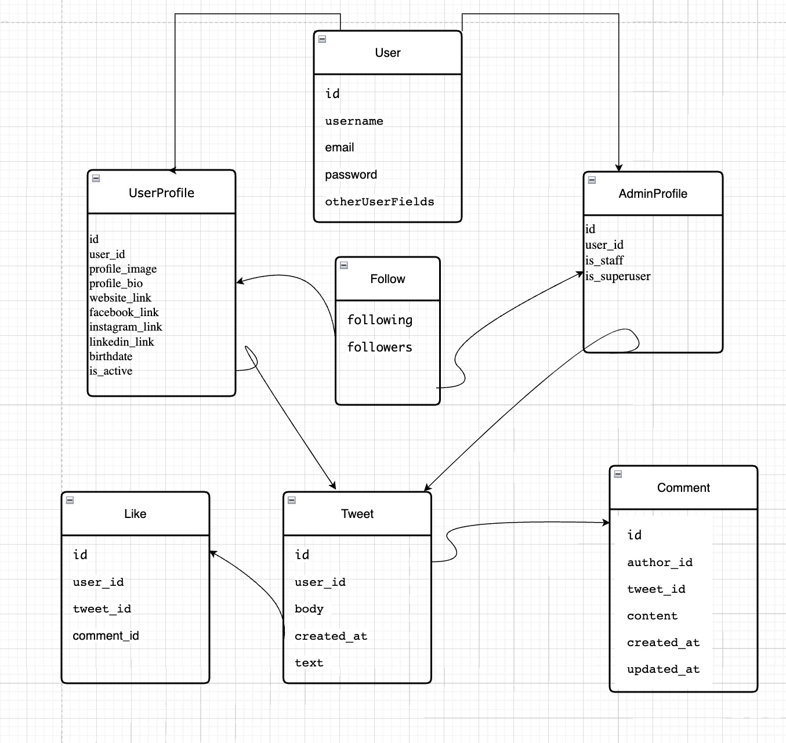

# twitter1.02
Twitter Social Network Project with Python &amp; Django Framework
This project is a social network platform built using Django. The purpose of this project is to create a platform where users can create posts, comment on posts, and interact with other users in a social setting. The platform will allow users to share their thoughts, ideas, and opinions with a wider audience and engage in conversations on various topics.
# Table of Contents

- [Features](#features)
- [ERD](#ERD)
- [Prerequisites](#prerequisites)
- [How to Run?](#HowtoRun?)
- [License](#license)
- [Acknowledgements](#acknowledgements)

# features
The social network platform like Twitter have these features
User registration and login: Users can create an account and login to the platform using their email and password.
User profiles: Users can create a profile that includes their username, profile picture, and bio.
Post Tweet and editing: Users can create new tweets and see others' tweets and edit their existing tweets and search tweets.
Post comments: Users can comment on posts and engage in conversations with other users.
Post likes: Users can like posts to show their appreciation for the content.

# ERD



## Prerequisites

make sure you have the following requirements:

    Python 3.8.x or higher
    Django 3.2.x or higher
    Other dependencies listed in the requirements.txt file
    
## How to Run?
    1. Clone the Project
    ```
    git clone https://github.com/amiiirm8/twitter1.02
    ```
    2. Create a Virtual Environment
    ```
    python3 -m venv venv
    ```
    3. Activate the Interpreter of the Virtual Environment
        * Windows:
        ```
        venv\Script\active
        ```
        * Linux/Mac os:
        ```
        source venv/bin/active
        ```
    4. Install the Requirements
    ```
    pip install -r requirements.txt
    ```
    
    5. Run the migrations
    '''
    python3 manage.py makemigrations
    
    python3 manage.py migrate
    
    '''
    6. Create a superuser account
    '''
    python manage.py createsuperuser
    '''
    7. Write the Following Command to Run the Server
    ```
    python manage.py runserver
    '''


## License

This project is licensed under the MIT License - see the LICENSE file for details.

## Acknowledgements
Daneshkar Academy
